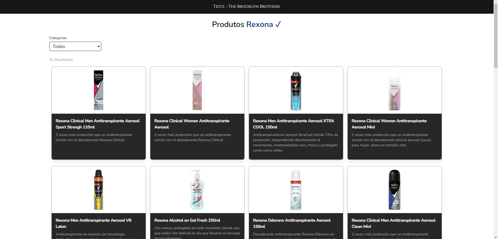

##  Teste para vaga

Este teste consiste em consumir um JSON de produtos e listar eles em uma página, e também criar um filtro de categorias. Eu subi o JSON no site [JSON Bin](https://jsonbin.io/app/dashboard) onde eu consigo consumi-lo via API. 

Você pode visualizar o projeto em produção, o deploy foi feito na Netlify. [Projeto em produção](https://fantastic-chimera-91fdae.netlify.app/)

### 🛠️ Stack

  - ReactJS
  - NextJS
  - TailwindCSS
  - Axios
  
### 📋 Como rodar o projeto
  
  PS: É necessário as chaves de acesso para fazer requisições a API do JSONBin, então caso queira elas basta me chamar via [LinkedIn](https://www.linkedin.com/in/yuri-homen-de-mello-ferreira-b04232191/) ou no [Instagram](https://www.instagram.com/yuri.hmello/), que eu libero o acesso e te envio as chaves.
  
  - Após conseguir as chaves, basta dar um fork ou clonar o projeto para a sua máquina.
  - Entre na pasta do projeto pelo terminal.
  - Rode o comando `yarn dev` e pronto!

---

### 📸 Screenshot

  
  
  
